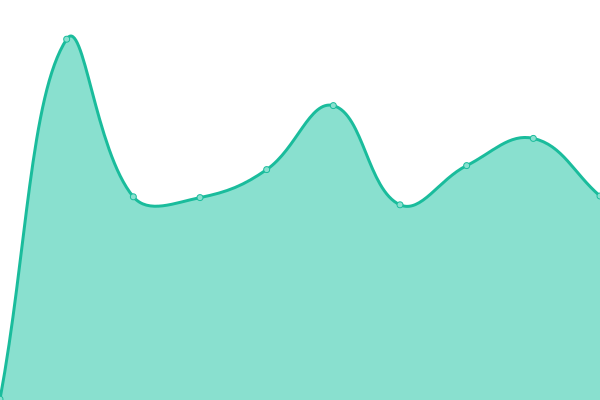
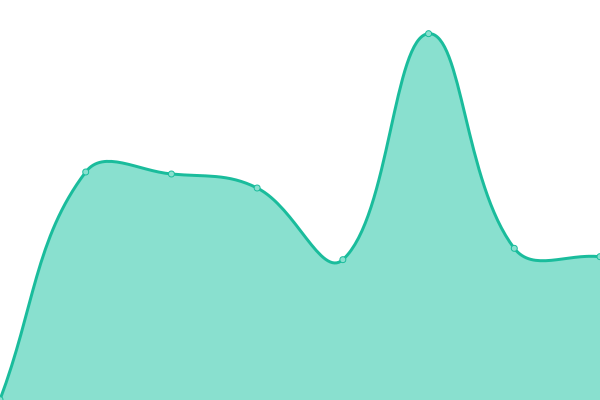

# [📈 Live Status](https://uptime.kulik.uz): <!--live status--> **🟧 Partial outage**

This repository contains the open-source uptime monitor and status page for [RenOK](https://uptime.kulik.uz), powered by [Upptime](https://github.com/upptime/upptime).

With [Upptime](https://upptime.js.org), you can get your own unlimited and free uptime monitor and status page, powered entirely by a GitHub repository. We use [Issues](https://github.com/totavok8/uptime_kulik/issues) as incident reports, [Actions](https://github.com/totavok8/uptime_kulik/actions) as uptime monitors, and [Pages](https://uptime.kulik.uz) for the status page.

<!--start: status pages-->
<!-- This summary is generated by Upptime (https://github.com/upptime/upptime) -->
<!-- Do not edit this manually, your changes will be overwritten -->
<!-- prettier-ignore -->
| URL | Status | History | Response Time | Uptime |
| --- | ------ | ------- | ------------- | ------ |
|  [Kulik House](cloud.kulik.uz) | 🟩 Up | [kulik-house.yml](https://github.com/totavok8/uptime_kulik/commits/HEAD/history/kulik-house.yml) | 

 541ms
     
 | 

<a href="https://totavok8.github.io/uptime_kulik/history/kulik-house">75.95%</a>
    

|  [Plugin Kulik](http://cdn.kulik.uz/) | 🟩 Up | [plugin-kulik.yml](https://github.com/totavok8/uptime_kulik/commits/HEAD/history/plugin-kulik.yml) | 

 476ms
     
 | 

<a href="https://totavok8.github.io/uptime_kulik/history/plugin-kulik">100.00%</a>
    

|  [RU-Server](ruclast.kulik.uz) | 🟥 Down | [ru-server.yml](https://github.com/totavok8/uptime_kulik/commits/HEAD/history/ru-server.yml) | 

 0ms
     
 | 

<a href="https://totavok8.github.io/uptime_kulik/history/ru-server">0.00%</a>
    

|  [DE-Server](deuts-cdn.kulik.uz) | 🟥 Down | [de-server.yml](https://github.com/totavok8/uptime_kulik/commits/HEAD/history/de-server.yml) | 

 0ms
     
 | 

<a href="https://totavok8.github.io/uptime_kulik/history/de-server">0.00%</a>
    

<!--end: status pages-->

[**Visit our status website →**](https://uptime.kulik.uz)

## 📄 License

- Powered by: [Upptime](https://github.com/upptime/upptime)
- Code: [MIT](./LICENSE) © [RenOK](https://uptime.kulik.uz)
- Data in the `./history` directory: [Open Database License](https://opendatacommons.org/licenses/odbl/1-0/)
